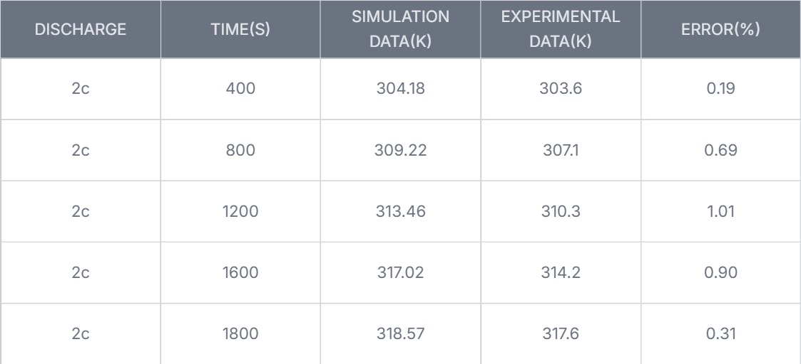
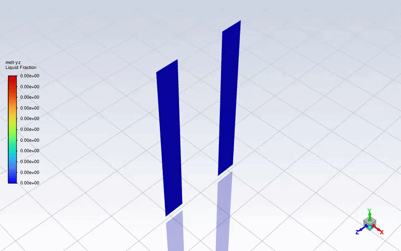
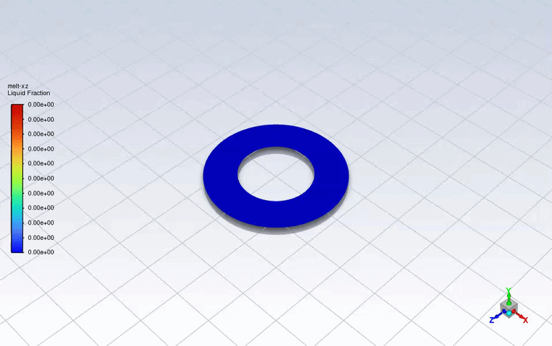

# Battery-PCM-Thermal-Management
Modeled and simulated the transient melting process of a PCM using the Enthalpy-Porosity formulation in ANSYS Fluent to analyze latent heat energy storage. 
# Thermal Management of Batteries Using Phase Change Materials (PCM)

A numerical study simulating heat absorption and melting kinetics of PCMs (in this case OM-46 and OM-34 organic paraffin PCMs) integrated with cooling sinks.

---

##  Project Overview

This repository contains simulation scripts, mesh setups, and thermal analysis files evaluating the cooling efficiency of PCM under transient heat loads. The project models latent heat transfer during phase transitions to prevent peak temperature spikes.

---

##  Tools & Technologies

* **Solver / Software:** ANSYS Fluent
* **Methodology:** Enthalpy-Porosity Method for Solid-Liquid Phase Change
* **Languages:**  C for user defined function(udf) for internal heat generation of batteries / MATLAB
* **Visualization:** ANSYS Results

---

##  Key Governing Equations

The phase change process is modeled using the energy equation with sensible and latent heat transfer:

$$\rho C_p \frac{\partial T}{\partial t} = \nabla \cdot (k \nabla T) - \rho L \frac{\partial \gamma}{\partial t}$$

Where:
* $T$ = Temperature ($K$)
* $\gamma$ = Liquid fraction ($0 \le \gamma \le 1$)
* $L$ = Latent heat of fusion ($J/kg$)

##  Battery Heat Generation Model (Bernardi Equation)

The total heat generation rate inside the lithium-ion cell during operation is modeled using the **Bernardi Heat Generation Equation**:

$$\dot{q} = \frac{I}{V_{\text{cell}}} \left[ (E_{\text{ocv}} - V_{\text{cell}}) - T \frac{d E_{\text{ocv}}}{d T} \right]$$

Where:
* $\dot{q}$ = Volumetric heat generation rate ($\text{W/m}^3$)
* $I$ = Operating current ($\text{A}$) — positive for discharge, negative for charge
* $V_{\text{cell}}$ = Total volume of the cell ($\text{m}^3$)
* $E_{\text{ocv}}$ = Open-Circuit Voltage ($\text{V}$)
* $V_{\text{cell}}$ = Cell terminal voltage ($\text{V}$)
* $T$ = Absolute temperature of the cell ($\text{K}$)
* $\frac{d E_{\text{ocv}}}{d T}$ = Temperature coefficient / entropic coefficient ($\text{V/K}$)

---
## Solver Settings and Boundary Conditions

### Solidification and Melting Model
For the given PCM Ansys inbuilt solidification and melting model was used with mushy zone constant taken as 100000.

### Energy Model
As for propogation of heat inside the cell, Energy model in Ansys Fluent was used.

## 📈 Simulation Results

### 1. Temperature profile over time for validation of UDF

Tested my UDF with a convective heat transfer coefficient of 5 W/m^2  and found an average error of 

### 2. PCM Liquid Fraction Evolution

Here are the temperature and Volume fraction animations for the PCM Jacket of OM-32

  
  

### The same can be seen in 2D volume fraction animations

  
  

### Effectiveness of PCM cooling

Reported average facet  temperature of the cell surface in contact with PCM was 314 K, which was a direct increase of 4 K from that of natual convection.
